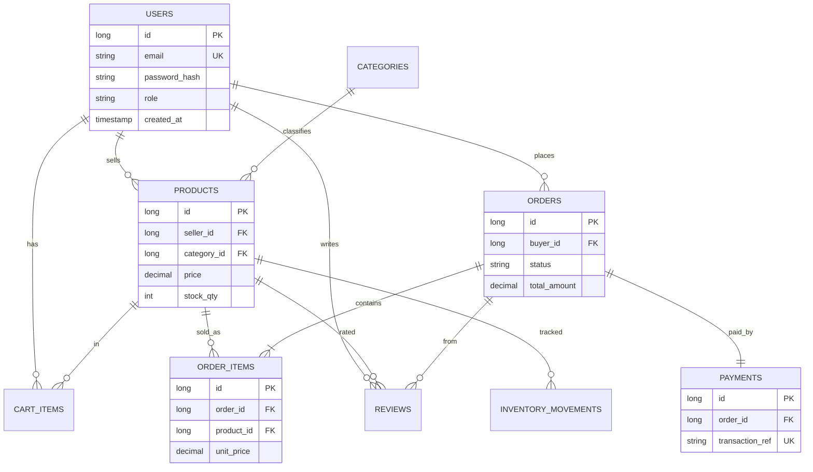

# D1 — ER diagram

Source: Section 4 schema, extended for payments, inventory, audit, categories.

```mermaid
erDiagram
    USERS ||--o{ PRODUCTS : sells
    USERS ||--o{ ORDERS : places
    USERS ||--o{ CART_ITEMS : has
    USERS ||--o{ REVIEWS : writes
    CATEGORIES ||--o{ PRODUCTS : classifies
    PRODUCTS ||--o{ CART_ITEMS : in
    PRODUCTS ||--o{ ORDER_ITEMS : sold_as
    PRODUCTS ||--o{ REVIEWS : rated
    PRODUCTS ||--o{ INVENTORY_MOVEMENTS : tracked
    ORDERS ||--|{ ORDER_ITEMS : contains
    ORDERS ||--|| PAYMENTS : paid_by
    ORDERS ||--o{ REVIEWS : from
    USERS {
        long id PK
        string email UK
        string password_hash
        string role
        timestamp created_at
    }
    PRODUCTS {
        long id PK
        long seller_id FK
        long category_id FK
        decimal price
        int stock_qty
    }
    ORDERS {
        long id PK
        long buyer_id FK
        string status
        decimal total_amount
    }
    ORDER_ITEMS {
        long id PK
        long order_id FK
        long product_id FK
        decimal unit_price
    }
    PAYMENTS {
        long id PK
        long order_id FK
        string transaction_ref UK
    }
```
