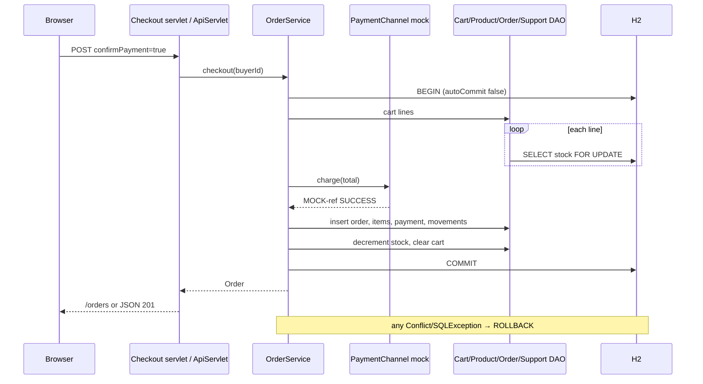

# D3 — Place-order sequence

Browser → page/API servlet → `OrderService.checkout` → DAOs → H2, including rollback path.

```mermaid
sequenceDiagram
    participant B as Browser
    participant S as Checkout servlet / ApiServlet
    participant O as OrderService
    participant P as PaymentChannel mock
    participant D as Cart/Product/Order/Support DAO
    participant DB as H2
    B->>S: POST confirmPayment=true
    S->>O: checkout(buyerId)
    O->>DB: BEGIN (autoCommit false)
    O->>D: cart lines
    loop each line
        D->>DB: SELECT stock FOR UPDATE
    end
    O->>P: charge(total)
    P-->>O: MOCK-ref SUCCESS
    O->>D: insert order, items, payment, movements
    O->>D: decrement stock, clear cart
    O->>DB: COMMIT
    O-->>S: Order
    S-->>B: /orders or JSON 201
    Note over O,DB: any Conflict/SQLException → ROLLBACK
```
